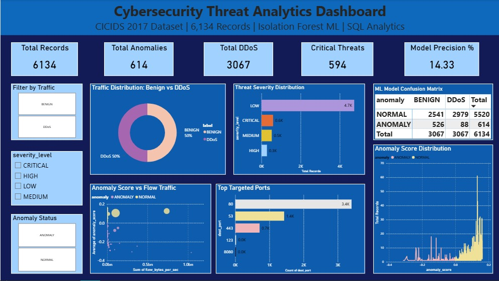

# Cybersecurity Threat Analytics & Insider Risk Intelligence System

## Project Overview

This project delivers an end-to-end cybersecurity analytics solution built using the CICIDS 2017 dataset. The objective was to analyze network traffic behavior, detect anomalous patterns using machine learning, and present actionable threat intelligence through an interactive Power BI dashboard.

The system integrates data preprocessing in Python, SQL-based analytics using SQLite, Isolation Forest anomaly detection, and executive-level visualization in Power BI. The final output provides both technical transparency and business-facing insights into network threats and attack surfaces.

---

## Dataset Information

- Dataset: CICIDS 2017  
- File Used: Friday-WorkingHours-Afternoon-DDos.pcap_ISCX.csv  
- Total Records Analyzed: 6,134  
- BENIGN Records: 3,067  
- DDoS Records: 3,067  

The dataset was balanced to ensure equal representation of benign and malicious traffic, allowing for clearer analytical comparison and more transparent model evaluation.

---

## Technology Stack

- Python (Pandas, NumPy)
- Scikit-learn (Isolation Forest)
- SQLite (SQL analytics layer)
- Power BI Desktop (Dashboard and visualization)
- Google Colab (Development environment)

---

## Project Workflow

### 1. Data Preparation

The raw network traffic data was cleaned and structured through the following steps:

- Removal of null, infinite, and duplicate records  
- Selection of 12 high-impact traffic features  
- Standardization and renaming of column labels  
- Creation of a balanced sample for analysis  
- Export to SQLite for structured query-based exploration  

This preprocessing ensured that downstream analytics and modeling were built on reliable data.

---

### 2. SQL-Based Analytical Layer

SQL queries were used to generate core threat intelligence insights, including:

- Traffic distribution percentages by label  
- Average behavioral metrics for BENIGN vs DDoS traffic  
- Top attacked ports  
- Severity classification based on traffic intensity  
- Port vulnerability ratios  
- Z-score–based anomaly ranking  

This analytical layer provided measurable insights before applying machine learning.

---

### 3. Machine Learning – Isolation Forest

An Isolation Forest model was implemented to detect anomalous network traffic patterns.

**Model Configuration**
- Contamination: 0.1  
- Estimators: 300  
- Selected Features: 5 key traffic metrics  

**Model Results**
- Anomalies Detected: 614  
- Normal Records: 5,520  
- Model Precision: 14.33%

---

### Confusion Matrix

|                | BENIGN | DDoS | Total |
|----------------|--------|------|-------|
| ANOMALY        | 526    | 88   | 614   |
| NORMAL         | 2541   | 2979 | 5520  |
| Total          | 3067   | 3067 | 6134  |

#### Interpretation

- 88 DDoS attacks were correctly detected.  
- 526 benign records were falsely flagged as anomalies.  
- 2,979 DDoS attacks were not detected.  

The contamination parameter (10%) was significantly lower than the true attack proportion (50%), resulting in conservative anomaly detection. This highlights the importance of hyperparameter tuning in real-world cybersecurity systems.

---

## Power BI Dashboard Overview

The dashboard consolidates analytical findings and ML results into a structured executive view.

### Key Dashboard Components

#### 1. KPI Layer
- Total Records: 6,134  
- Total Anomalies: 614  
- Total DDoS: 3,067  
- Critical Threats: 594  
- Model Precision: 14.33%  

This layer provides a high-level operational snapshot of system health.

---

#### 2. Traffic Distribution

The dataset shows an equal 50/50 split between BENIGN and DDoS traffic. This balanced structure enables unbiased comparison of behavior patterns.

---

#### 3. Threat Severity Distribution

Severity classification based on traffic metrics revealed:

- Low Severity: ~4.7K records  
- Critical Severity: 594 records  
- Medium Severity: 525 records  
- High Severity: 279 records  

While most traffic is categorized as Low, nearly 600 flows require immediate attention due to Critical severity classification.

---

#### 4. Top Targeted Ports

Port-level analysis identifies:

- Port 80 (HTTP) as the primary attack vector (~3.4K hits)  
- Followed by Ports 53 (DNS), 443 (HTTPS), and 22 (SSH)  

This indicates that web-facing services, particularly HTTP, represent the largest exposure surface in the analyzed traffic.

---

#### 5. Anomaly Score Distribution

The anomaly score visualization demonstrates separation between NORMAL and ANOMALY classifications. Higher anomaly scores align with suspicious network behavior, confirming that the model isolates unusual traffic flows.

---

#### 6. Confusion Matrix Transparency

The dashboard includes a confusion matrix to provide transparency into model performance, clearly identifying:

- True Positives  
- False Positives  
- False Negatives  
- True Negatives  

This ensures the system is analytically accountable rather than presenting anomaly detection as a black box.

---
## Dashboard Preview

---
## Key Insights

1. Port 80 is the dominant attack surface and should be prioritized for security hardening.  
2. 594 flows are classified as Critical threats and require monitoring.  
3. The Isolation Forest model detected 614 anomalous records.  
4. Precision of 14.33% indicates conservative anomaly detection behavior.  
5. A significant portion of DDoS traffic remains undetected due to low contamination settings.

---

## Recommended Solutions

Based on analytical and dashboard findings:

1. Adjust the Isolation Forest contamination parameter to better reflect actual attack ratios.  
2. Evaluate supervised classification models such as Random Forest or Gradient Boosting to improve recall.  
3. Deploy Web Application Firewall (WAF) protections on Port 80.  
4. Implement rate-limiting and SYN flood mitigation mechanisms.  
5. Prioritize real-time alerting for Critical severity flows.

---

## Project Architecture

1. Data Ingestion (CSV)  
2. Data Cleaning and Feature Engineering (Python)  
3. SQL Analytics Layer (SQLite)  
4. Machine Learning Anomaly Detection (Isolation Forest)  
5. Data Export for Visualization  
6. Power BI Executive Dashboard  

---

## Conclusion

This project demonstrates a complete cybersecurity analytics lifecycle:

- Data preprocessing and feature engineering  
- SQL-based threat intelligence extraction  
- Machine learning anomaly detection  
- Executive dashboard visualization  
- Actionable security recommendations  

It bridges technical data science implementation with operational cybersecurity insight, making it applicable for data analyst, security analyst, and threat intelligence roles.

---
